# Práctica 4 - Networking (Tema 3, Nodejs The Right Way)

### Integración continua con Travis
En este link se accede directamente al estado de travis -> 

## Conexiones con Sockets 

Los servicios de red existen para hacer dos cosas: conectar dos puntos y transmitir información a través de ellos. En este capítulo aprenderemos a crear sockets usando Node.js.

### Uniendo un servidor a un Puerto TCP

Las conexiones con sockets TCP consisten en dos puntos finales. Uno de ellos se une a un puerto numerado mientras que el otro se conecta a un puerto. Es muy parecido a un sistema de telefonía. En nodejs la unión y conexión son proporcionadas por el módulo **net**. 

### Escribiendo datos en un socket

Comenzaremos creando un directorio llamado **networking** donde guardaremos el código con el que vamos a trabajar. En este directorio crearemos nuestro primer código ***net-watcher.js***:

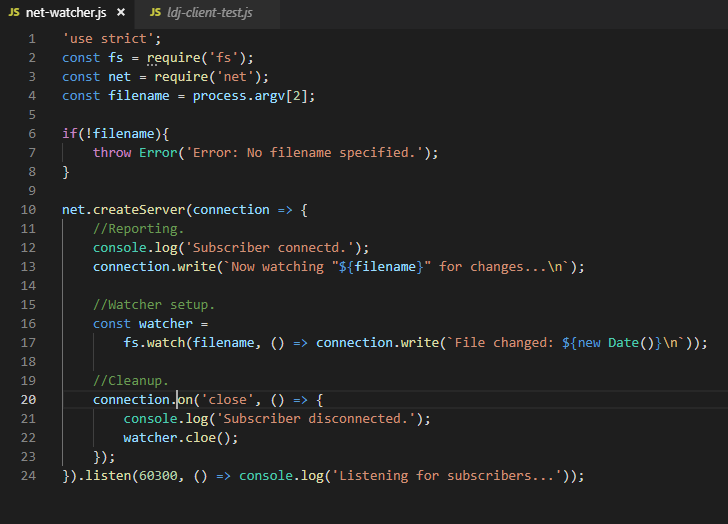

En la parte de arriba del código llamamos a los módulos de núcleo de Node.js, *fs* y *net*. El nombre del documento a vigilar será el tercer argumento en process.argv. 

Fijándonos en la función callback dada a *createServer*, hace tres cosas:

1. Reporta que la conexión se ha establecido.
2. Empieza a escuchar por si se producen cambios en el documento establecido.
3. Escucha hasta que se haya realizado el cierre de la conexión.

Finalmente, se le pasa una función callback al final a *server.listen*, Node.js invoca a esta función después de que el puerto 60300 se haya unido y esté listo para recibir conexiones.

### Conectando a un servidor TCP con Netcat

Para ejecutar y probar el programa anterior, necesitamos tres terminales: una para el servidor, una para el cliente y otra para realizar cambios en el documento establecido.

En la primera terminal, usamos el comando *watch* para 'touch' el documento elegido, con un intervalo de un segundo:

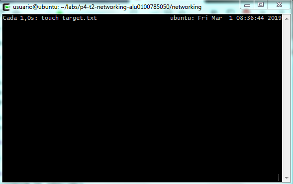

Con esto ejecutándose, en otra terminal, ejecutaremos el programa net-watcher, especificando qué fichero vamos a controlar:

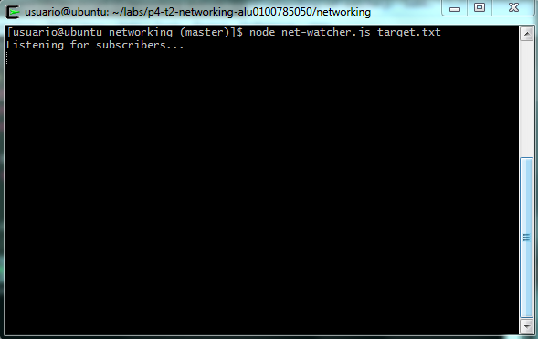

El programa crea un servicio escuchando en el puerto TCP 60300. Para conectarnos, usaremos netcat, un programa de sockets. Abriremos otra terminal y usaremos el comando **nc**:

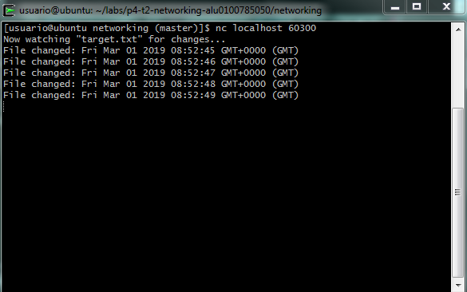

En la terminal del programa net-watcher, veremos como se realiza la conexión, y si pulsamos control+C la terminaremos.

### Escuchando en Sockets Unix

Para ver como el módulo *net* usa los sockets en Unix, modificaremos el programa net-watcher. Hay que tener en cuenta que los sockets Unix funcionan únicamente en sistemas Unix.

Abrimos el programa ***net-watcher.js*** y le cambiaremos la llamada a *listen*, lo guardamos con un nuevo nombre. 

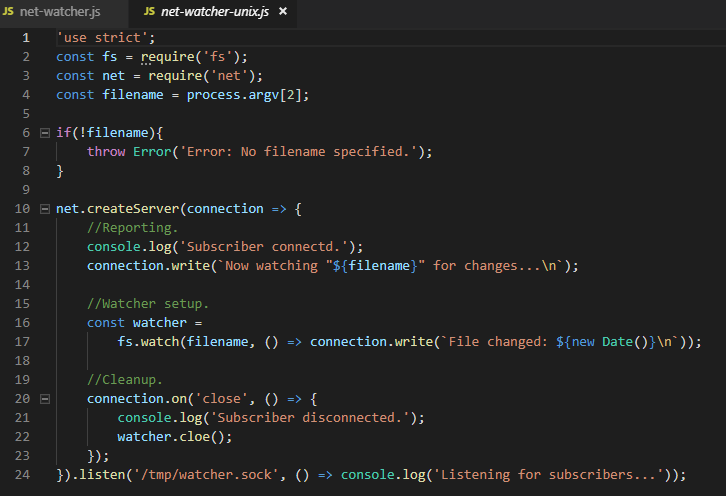

Lo ejecutamos, y observamos como está escuchando a posibles suscriptores:

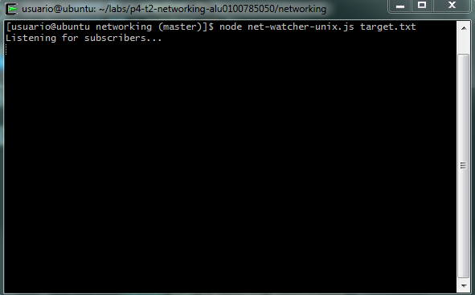

Para conectarse a un cliente, se utiliza *nc* como anteriormente, pero con un pequeño cambio, tendremos que especificar la etiqueta **-U** para que se haga uso del fichero socket.

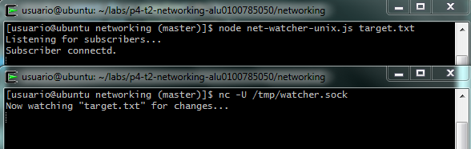

Los sockets de Unix pueden ser más rápidos que los TCP porque no requiren invocar hardware de red. Sin embargo, por naturaleza están confinados a la máquina.

## Implementando un Protocolo de Mensaje

Ya hemos visto como crear servidores de sockets que escuchan a conexiones entrantes en Node. En esta sección diseñaremos e implementaremos un protocolo mejorado. Un ***protocolo*** es un conjunto de reglas que definen como se comunican los puntos en un sistema. Ahora crearemos un protocolo basado en pasar mensajes JSON a través de TCP.

Implementaremos un cliente y un servidor que usarán nuestro nuevo protocolo basado en JSON. Esto nos dará la oportunidad de desarrollar pruebas y refactorizar nuestro código en módulos reusables.

### Mensajes serializados con JSON

Desarrollemos ahora el protocolo para serializar mensajes. Cada mensaje es un objeto JSON serializado, lo cual es un *hash* de pares clave-valor. Un ejemplo: *{"key":"value","anotherkey":"anothervalue"}*

El servicio net-watcher que hemos ido desarrollando a lo largo de este capítulo manda dos tipos de mensajes que necesitaremos convertir a JSON:

1. Cuando la conexión se establece, el cliente recibe la cadena: *Now watching "target.txt" for changes...*
2. Cuando el fichero especificado es modificado, el cliente recibe una cadena: *File changed: Fri Dec 18 2015 05:44:00 GMT-0500 (EST)*

Codificaremos el primer tipo de mensaje así: *{"type":"watching","file":"target.txt"}*.
El campo **type** indica que es un mensaje **watching**, el fichero especificado está siendo observado.

Codificaremos el segundo tipo de mensaje así: *{"type":"changed","timestamp":1358175733785}*.
El campo **type** anuncia que el fichero ha cambiado, **timestamp** contiene un valor entero representando el número de milisegundos desde la medianoche del 1 de Enero de 1970.

### Cambiando a Mensajes JSON

Ahora que hemos definido y mejorado el protocolo, modificaremos el servicio net-watcher para usarlo. Luego crearemos programas clientes que recibirán e interpretarán los mensajes.

Nuestra tarea es usar **JSON.stringify** para codificar los objetos mensaje y mandarlos a través de *connection.write*, **JSON.stringify** coge un objeto de JavaScript y devuelve una cadena que contiene una representación serializada de dicho objeto en formato JSON.

Debemos modificar el programa net-watcher.js:

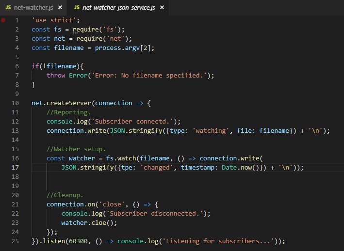

Vemos en la línea 13 y en la línea 16, como hemos modificado el programa para que haga uso de **JSON.stringify**. Guardamos este programa y lo ejecutamos.

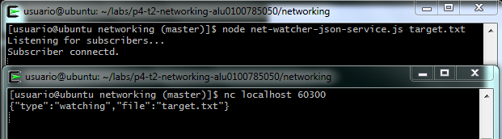

Nos conectamos mediante *netcat* desde una segunda terminal, cuando modifiquemos el fichero, veremos en la salida el mensaje.

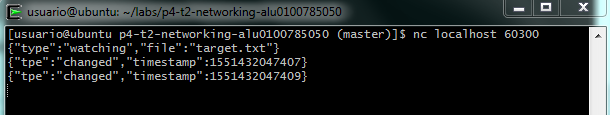

## Creando Conexiones de Clientes Sockets

A continuación, crearemos un programa cliente en Node.js para recibir mensajes JSON desde nuestro programa *net-watcher-json-service*.

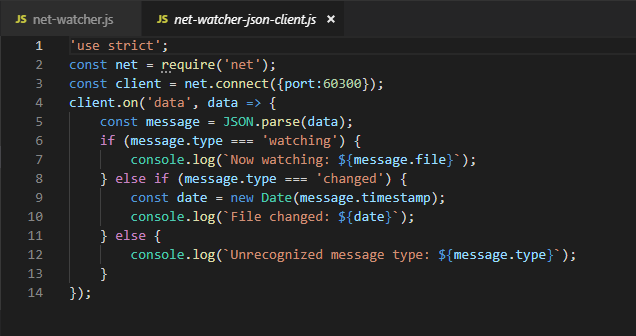

Este programa usa *net.connect* para crear una conexión cliente con el localhost por el puerto 60300, y espera a los datos. El objeto cliente es un socket, igual que la conexión entrante que vimos en el lado del servidor.

Cuando un evento de datos ocurra, la función callback coge el buffer entrante, transforma el mensaje JSON, y luego muestra un mensaje apropiado por consola.

Para verlo en funcionamiento, debemos asgurarnos que el servidor está en ejecución, y luego en otra terminal ejecutamos el cliente:

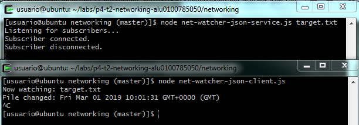

## Probando la Funcionalidad de la Aplicación de Red

Las pruebas funcionales nos aseguran que nuestro código hace lo que esperamos que haga. En esta sección, desarrollaremos una prueba para nuestros programas servidor y cliente observadores de ficheros. Crearemos un servidor simulado que cumple con nuestro protocolo LDJ al tiempo que expone los fallos en el cliente.

### Entendiendo el Problema del Límite de Mensaje

En Node.js a veces los mensajes llegan en piezas, separados en distintos eventos de datos. Necesitaremos lidiar con estas separaciones cuando ocurran. El protocolo LDJ que desarrollaremos anteriormente separa mensajes con caractéres de nueva línea. Cada carácter de nueva línea es el límite entre mensajes. 
Ejemplo:
*{"type":"watching","file":"target.txt"}\n
{"type":"changed","timestamp":1450694370094}\n
{"type":"changed","timestamp":1450694375099}\n*

### Implementando un Servicio de Pruebas

Ahora vamos a implementar un servicio de pruebas que separa un mensaje en múltiples cachos.

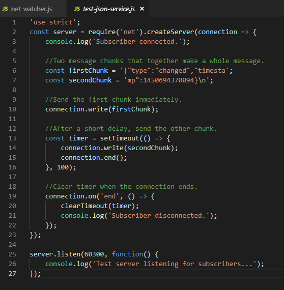

Este servicio difiere de nuestro anterior programa en varias formas. En vez de montar un observador de ficheros del sistema, aquí solo mandamos el primer trozo predeterminado. Después preparamos un cronómetro para mandar el segundo trozo después de un corto retraso. La función *setTimeout* usa dos parámetros: una función para invocar y una cantidad de tiempo en milisegundos. Al final, después de terminar la conexión, se usa *clearTimeout* para desprogramar la callbak, esto nos evitará que se disparen mensajes de error.

Veamos que ocurre cuando conectamos con el cliente:

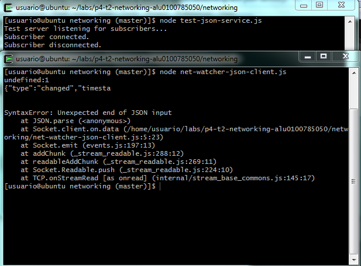

El error *Unxpected token* nos dice que el mensaje no está completo y no es un JSON válido. Hasta ahora hemos simulado el caso de separar un mensaje desde el servidor, ahora arreglaremos el cliente.

## Extendiendo Clases del Núcleo en Módulos Customizables

El programa que hicimos en la sección anterior tenía una debilidad en el código del cliente, no sacaba las entradas. Cualquier mensaje que llega como eventos de datos múltiples da error. El programa cliente tiene dos trabajos que hacer, uno es sacar datos entrantes en mensajes, y el otro es manejar cada mensaje cuando llegue.

Para no tener que meter ambos trabajos en un mismo programa, la solución correcta es transformar al menos uno de ellos en un módulo Node.js. Crearemos un módulo que maneje la pieza de entrada para que el programa principal pueda obtener mensajes completos. 

### Extendiendo EventEmitter

Para liberar al programa cliente del peligro de separar mensajes JSON, implementaremos un módulo cliente LDJ. Más tarde lo incoporaremos al cliente *network-watcher*.

### Herencia en Node

LDJClient es una clase, lo que significa que otros códigos pueden llamarla para obtener una instancia. Dentro del constructor llamamos a *super* para invocar a la función de construcción de *EventEmitter*. Cuando se esté implementando una clase que extiende otra clase, se debe empezar llamando a super, con el constructor apropiado.

~~~
const EventEmitter = require('events').EventEmitter;
 class LDJClient extends EventEmitter {
    constructor(stream) {
    super();
 	  }
 	}
~~~

### Eventos de Datos de Búfer

Vamos a usar el paramétro *stream* en el LDJClient para recuperar y mandar la entrada. El objetivo es coger los datos entrantes desde el stream y convertirlos en eventos de mensajes que contienen los objetos de mensajes transformados.

El siguiente constructor actualizado coge trozos de datos entrantes y los pasa por un escáner que busca los finales de línea.
~~~
constructor(stream) {
		super();
		let buffer = '';
		stream.on('data', data => {
			buffer += data;
			let boundary = buffer.indexOf('\n');
			while (boundary !== -1) {
				const input = buffer.substring(0,boundary);
				buffer = buffer.substring(boundary+1);
				this.emit('message', JSON.parse(input));
				boundary = buffer.indexOf('\n');
			}
		});
	}
~~~
  
Comenzamos llamando a super, y creando una variable de cadena llamada buffer. Más adelante usamos *stream.on* para manejar eventos de datos. Cada cadena de mensaje se manda a través de *JSON.parse* y finalmente emitido por LDJClient como un evento de mensaje via *this.emit*.

Ahora necesitamos poner esta clase en un módulo Node.js para que nuestro cliente pueda usarlo.

### Exportando Funcionalidad en un Módulo

Crearemos un directorio llamado *lib*, por convenio en Node.js se almacena todo código de soporte en el directorio *lib*. Lo guardaremos como ***ldj-client.js***.

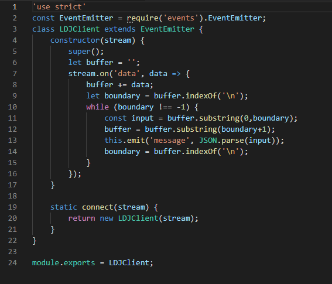

El objeto *module.exports* es el puente entre el código del módulo y el mundo exterior.

### Importando un Módulo Node.js Customizado

Modificaremos el cliente para usar el módulo:

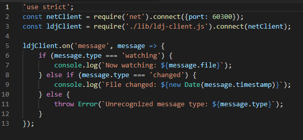

Para asegurar que se ha resuelto el problema del mensaje separado, ejecutamos el servicio:

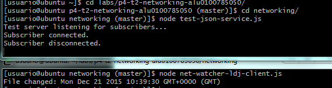

Vemos que funciona correctamente.

## Desarrollando Pruebas Unitarias con Mocha

Mocha es un entorno de pruebas para Node.js. Cuenta con diferentes estilos para describir sus tests. Usaremos el Desarrollo Conducido por el Comportamiento (BDD). Para hacer uso de Mocha primero lo instalamos con npm.

### Instalando Mocha con npm

Ejecutamos **npm init -y** para generar un *package.json*:

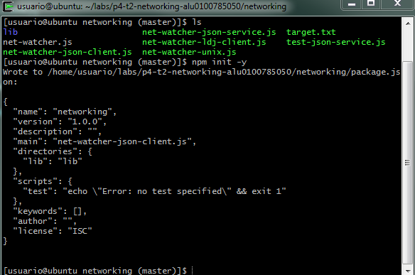

Luego ejecutamos **npm install --save-dev --save-exact mocha@3.4.2**. Cuando la instalación acabe tendremos un directorio *node_modules* que contiene las dependencias de Mocha. Y en el fichero *package.json* encontraremos las dependencias:

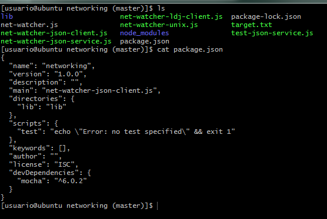

En Node.js hay varios tipos de dependencias, las regulares y las de desarrollo (regular y dev). Ambas se instalan cuando se ejecuta **npm install** sin argumentos extra, si queremos instalar solo las regulares y no las dev, se ejecuta **npm install --production** o estableciendo la variable de entorno NODE_ENV a *production*.

### Versionamiento Semántico de Paquetes

La etiqueta *--save-exact* le dice a npm que versión específica queremos instalar. Por defecto, npm usa el versionamiento semántico para encontrar la mejor versión disponible de un paquete.

El número de la versión consta de tres partes unidas por puntos, la versión principal, la versión menor y el parche.

* Si la modificación del código no introduce o elimina ninguna funcionalidad, se incrementa la versión del parche.
* Si la modificación introduce funcionalidad pero no elimina o altera la funcionalidad ya existente, se incrementa la versión menor y se resetea el parche.
* Si la modificación altera o rompe la funcionalidad existente, se incrementa la versión principal y se resetea la versión menor y el parche.

### Escribiendo Pruebas Unitarias con Mocha

Crearemos un directorio llamado *test*, esto está establecido por convenio para todos los proyectos de Node.js, y por defecto Mocha buscará los tests en este directorio.

Este es un código de pruebas, primero llamamos a los módulos que vamos a necesitar. Después usamos el método *describe* para crear un contexto que envuelve las pruebas con LDJClient. El segundo argumento de *describe* es una función que contiene el contenido de la prueba. Dentro de la prueba primero declaramos dos variables con *let*, entonces en *beforeEach* asignamos instancias a estas dos variables. Para terminar llamamos a *it* para poner a prueba un comportamiento específico de la clase.

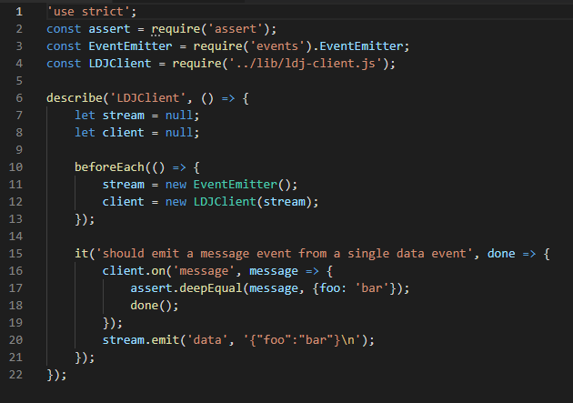

### Ejecutando Pruebas de Mocha desde npm

Para ejecutar Mocha usando npm, debemos añadir una entrada al *package.json*, en la sección scripts.

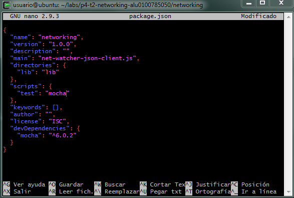

Ejecutamos las pruebas con npm:

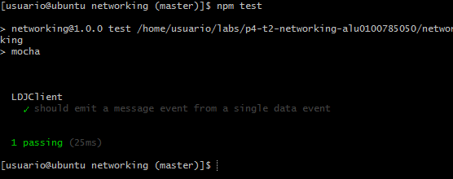

## Problemas resueltos

### Testabilidad

1. Añadir una prueba unitaria para un mensaje que se separa en dos o más eventos de datos desde el stream.
2. Añadir una prueba unitaria que pase **null** al constructor del cliente, y lance un error.

Creamos las dos pruebas, la primera añade el salto de línea al stream,y la segunda comprueba con el assert si el constructor se ha construido con null.

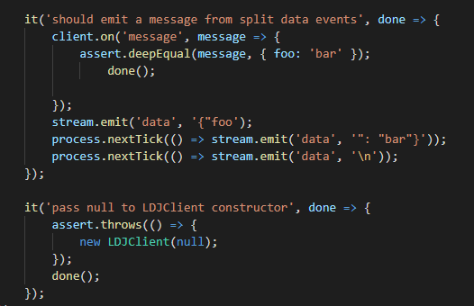

En el constructor debemos modificarlo para que compruebe si el stream es null y lance el error.

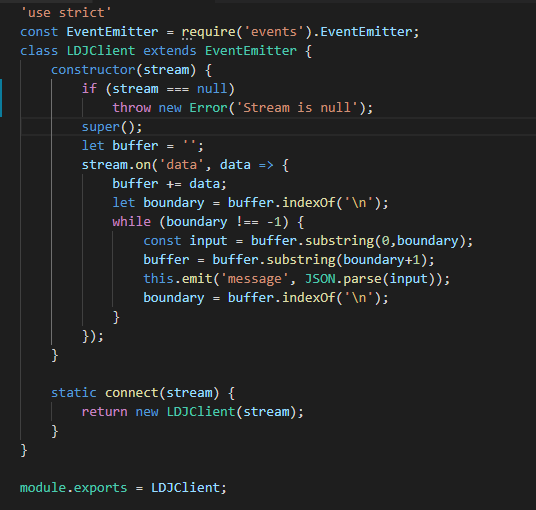

Comprobamos que las pruebas funcionan correctamente.

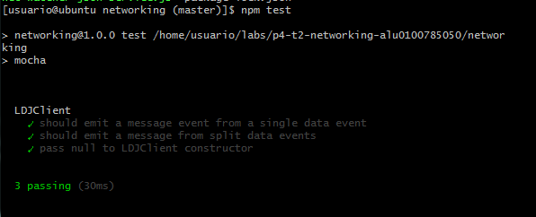

### Robustez

3. El cliente ya maneja casos en los que una cadena correctamente formateada en JSON se divide en múltiples líneas. ¿Qué pasará si los datos entrantes no están formateados como JSON?

El programa abortaría y fallaría porque no sabe manejar ese tipo de error.

4. Escribe una prueba unitaria que envia eventos de datos que no son JSON. 

La prueba es muy sencilla, un assert que emita el stream que no es JSON.

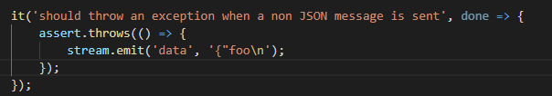

El constructor se debe modificar para añadir un bloque try/catch donde comprueba si es JSON o no.

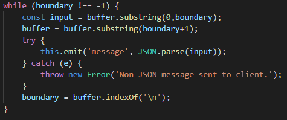

Comprobamos que el test resulta exitoso.

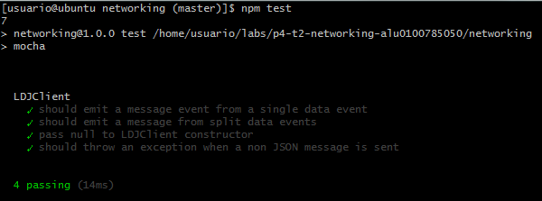

5. ¿Qué pasaría si el último evento de datos completa un mensaje JSON, pero sin el salto de línea final?

El programa abortaría, fallaría porque no sabe manejar dicho problema.

6. Escribe una prueba unitaria donde el objeto stream manda un evento de datos conteninedo solo JSON sin la línea final, seguido de un evento de cierre.

Creamos una prueba unitaria donde añadimos el stream que emite el evento de cierre.

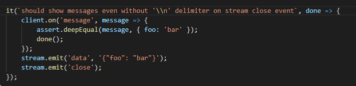

Modificamos el constructor añadiendo un stream.on donde comprueba si se encuentra el '}' final, y no el salto de línea.

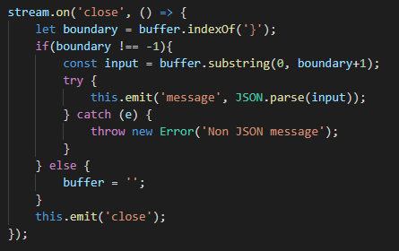

Vemos que todos los test han acabado exitosamente.

7. ¿Debería el cliente emitir un evento de cierre para los listeners?

Debería emitirlo cuando el listener no esté enviando nada, y cuando el listener haya avisado de que cierra conexión.

  
